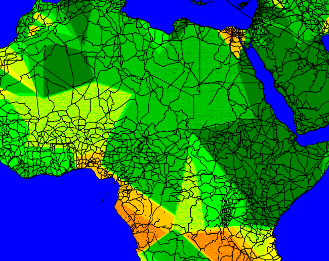

# heatchmap -> geoheatmap @pypi

Important: if you are willing to just try it out or contribute reach out to me first. This repo needs some cleaning :)

### Modelling

- do not want to color where we have no certainty/ data
- in europe normal distribution with 50 km stdv is a good asumption

### Problems

For low density of points far away averaging them works poorly because calculation are on really small numbers (tail of normal distribution). We get hard edges:

Instabilities between color scale sections:

